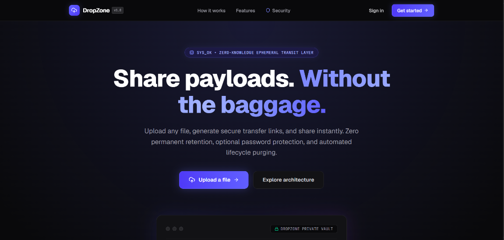

# DropZone

Ephemeral, secure, and self-cleaning file sharing infrastructure built on a decoupled control-and-data-plane architecture.



DropZone solves the security and storage lifecycle problems of modern file transfer. Traditional file-sharing solutions either persist uploads indefinitely, require expensive managed cloud storage accounts for every user, or rely on manual file deletion. DropZone provides controlled, temporary file access with fine-grained download limits, time-based expiration, optional bcrypt password protection, instant link revocation, and automated asynchronous background cleanup.

From a system design perspective, DropZone strictly separates the **Control Plane** (authentication, resource authorization, metadata persistence, rate limiting, and queue orchestration) from the **Data Plane** (high-throughput binary file upload and download directly via Amazon S3 presigned URLs). This ensures the core API compute layer remains completely stateless and unburdened by heavy payload streaming.

---

## 1. Problem Statement

Traditional file sharing introduces significant operational and security overhead:
- **Persistent Storage Bloat**: Files uploaded for a one-time transaction remain in cloud storage indefinitely unless manually deleted.
- **Compute Exhaustion**: Naive backend implementations proxy large file uploads and downloads through application servers, consuming memory, network I/O, and worker threads.
- **Uncontrolled Data Access**: Shared links often lack basic access controls such as time-based expiration, maximum download thresholds, password protection, or instant kill-switch revocation.

DropZone is engineered to provide **ephemeral file transit**:
1. Files are uploaded directly to private object storage without passing binary bytes through backend application servers.
2. Share links act as capability tokens governed by explicit validity rules (expiry timestamp, maximum download count, bcrypt-hashed passwords, and revocation flags).
3. Once a share link expires or triggers a "delete-after-download" condition, an asynchronous background queue reliably purges both the underlying object from S3 and its metadata from PostgreSQL.

---

## 2. Requirements

### Functional Requirements
- **User Authentication & Synchronization**: Authenticated users can log in via Clerk and are automatically synchronized into the PostgreSQL database on demand.
- **Direct-to-S3 Upload Generation**: Authenticated users request presigned S3 PUT URLs to upload files directly to private storage.
- **Metadata Persistence**: File metadata (name, storage key, MIME type, size, owner ID) is saved upon successful upload.
- **Share Link Management**: File owners can generate cryptographically secure share links with optional expiry dates, maximum download limits, password protection, and a "delete-after-download" flag.
- **Link Revocation & Deletion**: Owners can manually revoke active share links or delete files and associated links at any time.
- **Public Recipient Access**: Recipients can access share links and download files without creating a DropZone account or authenticating with Clerk.
- **Password Enforcement**: Password-protected links require recipients to provide the correct password before issuing a temporary download URL.
- **Automated Asynchronous Cleanup**: When a "delete-after-download" link is accessed, a delayed background job purges the file from S3 and PostgreSQL.
- **Owner Dashboard**: Provides real-time statistics (total files, total share links, total downloads) and management options for user-owned assets.

### Non-Functional Requirements
- **Decoupled Data Plane**: No file binary data streams through the Express API server.
- **Stateless Compute Layer**: The API server maintains no local state, allowing vertical and horizontal scaling.
- **Private Storage Security**: AWS S3 bucket blocks all public access; files are accessible only via short-lived (300-second) presigned URLs.
- **Distributed Rate Limiting**: Centralized Redis-backed rate limiting protects public download endpoints against brute-force attacks across multi-instance deployments.
- **Asynchronous Background Processing**: Storage and database cleanup operations are handled out-of-band by a dedicated worker process using BullMQ and Redis.
- **Strict Authorization Scoping**: Ownership checks (`file.ownerId === user.id`) ensure users can only modify or delete their own resources.

---

## 3. High-Level Architecture

```
                    ┌──────────────────┐
                    │  Next.js Client  │
                    │     (Vercel)     │
                    └────────┬─────────┘
                             │
            ┌────────────────┴────────────────┐
            │ HTTPS                           │ Direct S3 Upload / Download
            ▼                                 ▼
   ┌──────────────────┐             ┌──────────────────┐
   │   Express API    │             │      AWS S3      │
   │    (Railway)     │             │ (Private Bucket) │
   └─────┬─────┬──────┘             └──────────────────┘
         │     │
   ┌─────┘     └──────────────┐
   ▼                          ▼
┌──────────────┐       ┌──────────────┐
│  PostgreSQL  │       │Upstash Redis │
│   (Neon)     │       └──────┬───────┘
└──────────────┘              │
                              ▼
                       ┌──────────────┐
                       │BullMQ Worker │
                       │  (Railway)   │
                       └──────────────┘
```

### Component Responsibilities

1. **Next.js Client (Vercel)**: React 19 app router interface providing the owner dashboard, upload workspace, and public recipient download views.
2. **Express API Server (Railway)**: Node.js/Express service handling Clerk authentication, resource authorization, S3 presigned URL generation, metadata operations, and job dispatching.
3. **AWS S3 (Amazon Web Services)**: Private object storage bucket holding all file payloads. Public access is disabled; read/write access is controlled via short-lived presigned URLs.
4. **PostgreSQL Database (Neon)**: Managed relational database storing structured entity records (`User`, `File`, `ShareLink`, `Download`).
5. **Upstash Redis**: Ephemeral memory store backing distributed API rate limiting (`rate-limit-redis`) and queue state management (`BullMQ`).
6. **BullMQ Worker (Railway)**: Dedicated background Node.js process executing delayed file cleanup and storage purging jobs out-of-band.

---

## 4. Why This Architecture?

### Control Plane vs. Data Plane Separation
The central design principle of DropZone is the total decoupling of the **Control Plane** from the **Data Plane**.

- **Control Plane**: Handles identity verification, permissions, metadata tracking, token generation, password verification, rate limiting, and queue scheduling. Executed by the Express API.
- **Data Plane**: Handles high-bandwidth binary data streams (file uploads and downloads). Executed directly between the Client browser and AWS S3.

### Advantages of Presigned S3 URLs
1. **Compute Cost & Resource Optimization**: The Express API server never buffers or streams file bytes. Server memory footprint remains tiny (~50MB RAM) regardless of whether users transfer 1MB or 5GB files.
2. **Infinite Data Throughput**: File transfers leverage AWS S3’s global infrastructure, maximizing transfer speed without bottlenecking backend CPU or network interfaces.
3. **Simplified Backend Scaling**: Because the API is completely stateless with respect to file storage, backend server instances can be scaled horizontally behind a load balancer without sticky sessions or shared local disks.

---

## 5. End-to-End Upload Flow

```
User (Client)            Express API                     AWS S3              PostgreSQL
     │                        │                            │                     │
     │── 1. Request Upload ──>│                            │                     │
     │   (fileName, type)     │── 2. Create Presigned ────>│                     │
     │                        │      PUT URL (300s expiry) │                     │
     │<── 3. Return URL ──────│                            │                     │
     │   & Storage Key        │                            │                     │
     │                        │                            │                     │
     │── 4. Direct PUT File Payload ──────────────────────>│                     │
     │   (HTTP PUT binary stream)                          │                     │
     │<── 5. 200 OK ───────────────────────────────────────│                     │
     │                                                     │                     │
     │── 6. Save File Metadata (originalName, key, size) ─>│                     │
     │                                                     │── 7. INSERT File ──>│
     │<── 8. 201 Created ──────────────────────────────────│      Record         │
```

### Trade-Offs: Direct S3 Upload vs. API Proxying

| Parameter | Direct S3 Upload (Chosen) | API Proxying (Rejected) |
| :--- | :--- | :--- |
| **API Memory & CPU** | Negligible (~0% impact during transfers) | High (buffers chunks in Node RAM) |
| **API Bandwidth Costs** | Zero byte transit through server | Double transit (Client → API → S3) |
| **Max File Size Limit** | Constrained only by S3 limits | Constrained by Node RAM / HTTP timeouts |
| **CORS Configuration** | Required on S3 bucket | Not required on S3 bucket |
| **Atomic Consistency** | Requires two steps (upload payload, then save metadata) | Single transactional backend step |

---

## 6. End-to-End Download Flow

```
Recipient (Client)       Express API               PostgreSQL          AWS S3            Redis / BullMQ
     │                        │                         │                 │                    │
     │── 1. GET /share/<token>│                         │                 │                    │
     │── 2. POST /download ──>│                         │                 │                    │
     │                        │── 3. Lookup ShareLink ─>│                 │                    │
     │                        │<── 4. Return Link Data ─│                 │                    │
     │                        │                         │                 │                    │
     │                        │── 5. Validate Expiry,   │                 │                    │
     │                        │      Revocation, Limits │                 │                    │
     │                        │── 6. Verify Password    │                 │                    │
     │                        │      (bcrypt hash)      │                 │                    │
     │                        │                         │                 │                    │
     │                        │── 7. Record Download ──>│                 │                    │
     │                        │── 8. Increment Count ──>│                 │                    │
     │                        │                         │                 │                    │
     │                        │── 9. Generate Presigned ─────────────────>│                    │
     │                        │      GET URL (300s)     │                 │                    │
     │                        │                         │                 │                    │
     │                        │── 10. Queue Cleanup (if deleteAfter) ─────────────────────────>│
     │                        │                                                                │
     │<── 11. Return S3 URL ──│                                                                │
     │                                                                                         │
     │── 12. Direct GET File Payload ────────────────────────────────────────>│                    │
```

### Important Architectural Limitation: Delete-After-Download
Because browser downloads occur directly from S3 via presigned URLs, the Express API **cannot observe when the client finishes downloading bytes**.

Therefore, the `deleteAfterDownload` feature is implemented as:
> *"Schedule asynchronous cleanup 5 minutes after an authorized download request is issued."*

This guarantee prevents premature deletion while a download is starting, while ensuring the underlying S3 object and DB metadata are eventually purged.

---

## 7. Share Link Design

Share links serve as public capabilities. Access is granted based on knowledge of the token and compliance with embedded constraint rules.

### `ShareLink` Schema Fields
- `token` (`String`, `@unique`): 32-byte cryptographically secure random hexadecimal string (`crypto.randomBytes(32).toString('hex')`).
- `fileId` (`Int`): Foreign key referencing the targeted `File` record.
- `expiresAt` (`Timestamptz`, optional): ISO timestamp past which the link rejects requests with `410 Gone`.
- `maxDownloads` (`Int`, optional): Upper bound on allowed access attempts.
- `downloadCount` (`Int`, default `0`): Running total of successful authorization attempts.
- `passwordHash` (`String`, optional): `bcryptjs` hash (cost factor 12) of the required password. Plaintext passwords are never stored.
- `deleteAfterDownload` (`Boolean`, default `false`): Triggers asynchronous S3/DB purging when enabled.
- `revoked` (`Boolean`, default `false`): Instant kill-switch flag set by the file owner.

---

## 8. Database Design

DropZone uses PostgreSQL (via Neon) managed by Prisma 8 (`@prisma/orm-postgres`).

### Entity Relationship Diagram (ERD)

```
┌─────────────────────────┐
│          User           │
├─────────────────────────┤
│ id (PK)                 │
│ clerkId (UNIQUE)        │
│ email (UNIQUE)          │
│ username                │
│ name                    │
│ role (USER | ADMIN)     │
└────────────┬────────────┘
             │ 1
             │
             │ N
┌────────────┴────────────┐
│          File           │
├─────────────────────────┤
│ id (PK)                 │
│ originalName            │
│ storageKey (UNIQUE)     │
│ mimeType                │
│ size (BigInt)           │
│ ownerId (FK -> User.id) │
└────────────┬────────────┘
             │ 1
             │
             │ N (Cascade Delete)
┌────────────┴────────────┐
│        ShareLink        │
├─────────────────────────┤
│ id (PK)                 │
│ token (UNIQUE)          │
│ fileId (FK -> File.id)  │
│ expiresAt               │
│ maxDownloads            │
│ downloadCount           │
│ passwordHash            │
│ deleteAfterDownload     │
│ revoked                 │
└────────────┬────────────┘
             │ 1
             │
             │ N (Cascade Delete)
┌────────────┴────────────┐
│        Download         │
├─────────────────────────┤
│ id (PK)                 │
│ shareLinkId (FK)        │
│ ipAddress               │
│ userAgent               │
│ downloadedAt            │
└─────────────────────────┘
```

---

## 9. Why PostgreSQL / Neon?

### Architectural Rationale
1. **Relational Integrity**: Strict foreign-key relationships (`User -> File -> ShareLink -> Download`) prevent orphan records.
2. **Cascade Rules**: Configured `onDelete: Cascade` guarantees that deleting a `File` automatically purges associated `ShareLink` and `Download` logs.
3. **Serverless Scaling**: Neon provides instant branching, connection pooling via WebSocket, and automatic scaling suitable for cloud deployments.

### Comparison Matrix

| Database | Relational Integrity | Serverless Branching | ACID Compliance | Fit for DropZone |
| :--- | :--- | :--- | :--- | :--- |
| **PostgreSQL (Neon)** | Strong (Native FKs) | Yes (Native) | Full | **Ideal** |
| **MongoDB** | Weak (Application-level) | No | Document-level | Unnecessary complexity for relational schema |
| **MySQL** | Strong | Limited | Full | Lacks native serverless branching features of Neon |

---

## 10. Why AWS S3?

### Architectural Rationale
- **Durability & Availability**: 99.999999999% (11 9s) durability for stored object payloads.
- **Security Boundaries**: Bucket policies enforce complete private access (`BlockPublicAccess: TRUE`). Access is granted solely through signed signatures containing temporary IAM authorization credentials.
- **Cost Efficiency**: Pay-as-you-go object storage pricing eliminates disk provisioning management.

### Storage Comparison

| Storage Layer | Cost at Scale | Memory Overhead | Max Payload | Overall Rating |
| :--- | :--- | :--- | :--- | :--- |
| **AWS S3 (Chosen)** | Minimal ($0.023/GB) | 0 MB (Direct S3) | 5 TB | **Ideal** |
| **PostgreSQL BYTEA** | High ($0.30/GB) | High (Database RAM bloat) | 1 GB | Poor |
| **Local Disk (EBS/Server)**| Medium | High (Tightly coupled compute) | Disk limit | Poor (Prevents stateless scaling) |

---

## 11. Authentication and Authorization

### Authentication vs. Authorization

```
                          ┌──────────────────────────┐
                          │   Incoming HTTP Request  │
                          └─────────────┬────────────┘
                                        │
                                        ▼
                  ┌──────────────────────────────────────────┐
                  │          AUTHENTICATION LAYER            │
                  │             @clerk/express               │
                  │   Validates JWT Bearer Cookie/Header    │
                  └─────────────────────┬────────────────────┘
                                        │
                                        ▼
                  ┌──────────────────────────────────────────┐
                  │      USER SYNCHRONIZATION SERVICE        │
                  │           getOrCreateUser()              │
                  │ Fetch/Insert User Record in PostgreSQL   │
                  └─────────────────────┬────────────────────┘
                                        │
                                        ▼
                  ┌──────────────────────────────────────────┐
                  │           AUTHORIZATION LAYER            │
                  │  Strict Ownership Check in Route Handler │
                  │     if (file.ownerId !== user.id)        │
                  │          return 403 Forbidden            │
                  └──────────────────────────────────────────┘
```

- **Authentication**: Provided by Clerk (`@clerk/express` backend middleware, `@clerk/nextjs` frontend). Identifies *who* the caller is (`userId`).
- **Authorization**: Executed by custom backend route logic. Checks whether the authenticated user has permission to mutate or read the targeted resource (`file.ownerId === user.id`).

---

## 12. Redis and Rate Limiting

DropZone utilizes Upstash Redis via `ioredis` and `rate-limit-redis` to guard public download endpoints against brute-force attacks and denial-of-service attempts.

### Configuration (`server/src/middleware/rateLimiter.ts`)
- **Endpoint Protected**: `POST /api/share-links/:token/download` and `GET /api/share-links/:token/download`
- **Window**: 60 seconds (1 minute)
- **Max Requests**: 5 downloads per IP address per window
- **Store**: Centralized Redis store (`RedisStore`)

### Why Redis over In-Memory Rate Limiting?
If the API is scaled across multiple server instances (e.g., 3 Railway containers), in-memory stores maintain separate counters per instance. A client could make 15 requests (5 per instance) before being blocked. Centralizing state in Redis ensures rate limits are globally enforced regardless of API instance count.

---

## 13. BullMQ and Background Jobs

File cleanup operations are decoupled from client HTTP request loops using **BullMQ** and **Redis**.

```
Express Route (POST /download)
      │
      ├──> Returns 200 OK (Presigned S3 URL)
      │
      └──> fileCleanupQueue.add('delete-after-download', { fileId, storageKey }, { delay: 300000 })
                                      │
                                      ▼
                             Upstash Redis Queue
                                      │
                         (5-Minute Delay Expires)
                                      │
                                      ▼
                        BullMQ Worker Process (Standalone)
                                      │
                                      ├── 1. Verify File Exists in DB
                                      ├── 2. deleteFile(storageKey) from AWS S3
                                      └── 3. Delete File Record (Cascades to ShareLinks)
```

### Worker Resiliency Features
- **Decoupled Process**: Executed via `npm run worker` (`tsx src/workers/fileCleanup.worker.ts`) in an independent process container.
- **Exponential Backoff**: Configured with 3 retry attempts and exponential backoff (`delay: 5000ms`) if S3 or DB network calls fail.
- **Idempotency**: The worker verifies file existence prior to execution; if a file was manually deleted by its owner during the 5-minute window, the worker logs the event and exits cleanly.

---

## 14. Rate Limiting and Abuse Protection

DropZone implements layered defense-in-depth security:

| Threat Vector | Defense Mechanism | Layer |
| :--- | :--- | :--- |
| **Public Endpoint Brute-Force** | Distributed Redis Rate Limiting (5 req/min) | Ephemeral Memory (Redis) |
| **Unauthorized File Deletion** | Ownership Validation (`file.ownerId === user.id`) | Relational DB Control Plane |
| **Expired Link Harvesting** | Strict Expiry Timestamp Check (`expiresAt < now()`) | Business Logic |
| **Password Guessing** | `bcryptjs` Cost-Factor-12 Password Hashing | Crypto Compute |
| **Storage Key Tampering** | High-Entropy UUID Storage Keys (`crypto.randomUUID()`) | Object Storage Key Isolation |

---

## 15. Security Model

### Implemented Security Controls
- **Authentication**: Managed JWT session handling via Clerk.
- **Authorization**: Strict tenant-isolated resource ownership checks on all private API routes.
- **Private S3 Storage**: AWS bucket configuration blocks all public access (`BlockPublicAccess`).
- **Short-Lived Signed URLs**: Upload and download URLs expire in 300 seconds.
- **Cryptographic Randomness**: Share tokens generated using `crypto.randomBytes(32)`.
- **Password Security**: Passwords hashed using `bcryptjs` (salt round 12).
- **CORS Protection**: Express CORS configured strictly for trusted origins (`CLIENT_URL`).

### Explicitly Excluded (Not Implemented)
- Application-level payload encryption / End-to-End Encryption (E2EE).
- Antivirus or malware scanning of uploaded files.
- Web Application Firewall (WAF) rule engines.

---

## 16. Important Design Trade-offs

| Decision | Alternative | Why Chosen | Accepted Trade-Off |
| :--- | :--- | :--- | :--- |
| **S3 Direct Presigned URLs** | Proxying payloads via Express API | Zero server memory overhead & scalable transfers | Browser must handle direct S3 CORS interaction |
| **Delayed Asynchronous Cleanup** | Immediate S3 deletion upon URL request | Ensures client browser has time to finish download | 5-minute window where file remains in S3 before purge |
| **PostgreSQL (Neon)** | MongoDB / DynamoDB | Native relational foreign keys & cascade deletes | Schema migrations required for structural changes |
| **Redis-Backed Rate Limiting** | In-memory `express-rate-limit` | Multi-instance cluster rate limit consistency | Introduces dependency on Redis uptime |
| **BullMQ Dedicated Worker** | In-process `setTimeout()` | Job persistence across API server restarts | Requires running a second process container |
| **Clerk Managed Auth** | Self-hosted JWT / OAuth | Offloads user identity security & session management | Vendor dependency on Clerk availability |

---

## 17. Failure Scenarios

| Component Failure | Impact on System | System Behavior & Mitigation |
| :--- | :--- | :--- |
| **AWS S3 Outage** | Presigned URL generation succeeds, but transfers fail | S3 returns HTTP 500/503 during client transfer. Metadata remains safe in DB. |
| **PostgreSQL Outage** | API cannot authenticate users or look up metadata | Express routes return 500 error responses. Existing presigned URLs continue working until expiry. |
| **Redis Outage** | Rate limiting and BullMQ job scheduling pause | Express rate limiter degrades or throws error; cleanup jobs remain unqueued. |
| **Worker Process Crash** | Delayed cleanup jobs remain in Redis queue | BullMQ queue persists pending jobs in Redis; processing resumes immediately when worker restarts. |

---

## 18. Scalability Considerations

- **Stateless API Compute**: The Express API server maintains zero local state. Instances can be scaled horizontally behind a round-robin load balancer.
- **Offloaded I/O Traffic**: AWS S3 natively handles file transfer bandwidth, isolating backend compute from network saturation.
- **Bottlenecks at Scale**:
  1. *Database Connection Limits*: Mitigated using Neon's connection pooler.
  2. *Redis I/O*: Mitigated by storing minimal keys with explicit TTLs.

---

## 19. Consistency and Concurrency

### Download Count Concurrency
The current implementation increments `downloadCount` via read-then-update:
```typescript
await db.orm.public.ShareLink.where({ id }).update({
  downloadCount: shareLink.downloadCount + 1,
});
```
*Known Limitation*: Under high simultaneous request concurrency against the exact same share link, race conditions could cause undercounting. An atomic database increment (`downloadCount = downloadCount + 1`) is identified as a future hardening improvement.

### Multiple Share Links per File
If multiple share links point to the same underlying `fileId` and one link triggers `deleteAfterDownload`, the background cleanup job purges the `File` record, cascading deletion to all sibling `ShareLink` records.

---

## 20. API Overview

### Public Routes
- `GET /health` - Health check status.
- `GET /api/share-links/:token/download` - Retrieve file metadata & presigned S3 download URL (Rate Limited).
- `POST /api/share-links/:token/download` - Validate password & retrieve presigned S3 download URL (Rate Limited).

### Authenticated Routes (Clerk Auth Required)
- `GET /api/me` - Fetch or synchronize current user details.
- `POST /api/files/upload-url` - Generate presigned S3 PUT URL for uploading.
- `POST /api/files` - Persist metadata for successfully uploaded file.
- `DELETE /api/files/:id` - Delete owned file and associated storage objects.
- `POST /api/share-links` - Create a share link for an owned file.
- `POST /api/share-links/:id/revoke` - Revoke an active share link.
- `GET /api/dashboard` - Retrieve aggregated stats and file listings for current user.

---

## 21. Project Structure

```
dropzone/
├── client/                     # Next.js Frontend Application
│   ├── app/                    # App Router Pages
│   │   ├── dashboard/          # Owner File & Analytics Dashboard
│   │   ├── share/[token]/      # Public Recipient Download Page
│   │   ├── layout.tsx          # Root Layout & Clerk Provider
│   │   └── page.tsx            # Main Upload Workspace
│   ├── components/             # Reusable UI Components
│   ├── proxy.ts                # Next.js Clerk Middleware Config
│   ├── package.json
│   └── next.config.ts
├── server/                     # Express API & Background Worker
│   ├── src/
│   │   ├── config/             # Redis Configuration
│   │   ├── middleware/         # Redis Rate Limiter Middleware
│   │   ├── prisma/             # Prisma DB Client & Contract Schemas
│   │   ├── queues/             # BullMQ File Cleanup Queue
│   │   ├── routes/             # Express API Route Controllers
│   │   │   ├── dashboard.routes.ts
│   │   │   ├── files.routes.ts
│   │   │   └── share-links.routes.ts
│   │   ├── services/           # AWS S3 & User Sync Services
│   │   │   ├── s3.service.ts
│   │   │   └── user.service.ts
│   │   ├── workers/            # BullMQ Worker Handler Script
│   │   │   └── fileCleanup.worker.ts
│   │   ├── app.ts              # Express Application & Public Routes
│   │   └── server.ts           # API Server Entry Point
│   ├── Dockerfile              # Multi-Process Production Dockerfile
│   └── package.json
├── assets/                     # Project Screenshots & Visual Assets
│   └── dropzone-hero.png
├── .github/
│   └── workflows/
│       └── ci.yml              # GitHub Actions CI Workflow
└── README.md
```

---

## 22. Local Development

### Prerequisites
- Node.js `v22.x`
- Redis server (local or Upstash Redis URL)
- PostgreSQL database (Neon or local instance)
- AWS S3 Bucket & IAM Credentials

### 1. Server Setup
```bash
cd server
npm install
# Create .env file with required credentials
npm run dev
```

### 2. Background Worker Setup (Separate Terminal)
```bash
cd server
npm run worker
```

### 3. Client Setup (Separate Terminal)
```bash
cd client
npm install
# Create .env.local with NEXT_PUBLIC_API_URL=http://localhost:5000
npm run dev
```

---

## 23. Docker

The server includes a multi-purpose `Dockerfile` (`node:22-alpine`). The same image can run either the API process or the Worker process based on the start command:

### Build Image
```bash
docker build -t dropzone-backend ./server
```

### Run API Container
```bash
docker run -p 5000:5000 --env-file ./server/.env dropzone-backend
```

### Run Worker Container
```bash
docker run --env-file ./server/.env dropzone-backend npm run worker
```

---

## 24. CI/CD

Continuous Integration is powered by **GitHub Actions** (`.github/workflows/ci.yml`):

```
Push / Pull Request to main
           │
     ┌─────┴─────┐
     ▼           ▼
Backend Job  Frontend Job
  (Node 22)    (Node 22)
     │           │
  npm ci      npm ci
     │           │
npm run build npm run build
```

### Deployment Pipeline
- **Frontend**: Deployed automatically to **Vercel** on pushes to `main`.
- **API & Worker**: Deployed automatically to **Railway** as separate services using `Dockerfile`.

---

## 25. Production Architecture

- **Frontend**: Vercel (Next.js Edge/Serverless runtime)
- **API Service**: Railway (Docker container running `npm start`)
- **Worker Service**: Railway (Docker container running `npm run worker`)
- **Database**: Neon (Serverless PostgreSQL)
- **Cache / Queue**: Upstash (Serverless Redis)
- **Object Storage**: AWS S3 (US East / Custom Region)
- **Authentication**: Clerk Dev/Prod Tenant

---

## 26. Environment Variables

### Client (`client/.env.local`)
- `NEXT_PUBLIC_API_URL`
- `NEXT_PUBLIC_CLERK_PUBLISHABLE_KEY`

### Server (`server/.env`)
- `DATABASE_URL`
- `CLERK_SECRET_KEY`
- `CLERK_PUBLISHABLE_KEY`
- `AWS_ACCESS_KEY_ID`
- `AWS_SECRET_ACCESS_KEY`
- `AWS_REGION`
- `AWS_S3_BUCKET_NAME`
- `REDIS_URL`
- `CLIENT_URL`

---

## 27. Testing / Verification

- **Backend Compilation**: Validated via `tsc` (`npm run build` in `/server`).
- **Frontend Compilation**: Validated via `next build` (`npm run build` in `/client`).
- **CI Automation**: Runs linting and full production builds on every GitHub PR/push.

---

## 28. Current Limitations

1. **Upload Completion Tracking**: Relies on the frontend calling `POST /api/files` after S3 upload succeeds. If a client closes the browser after S3 upload but before metadata POST, an orphan object exists in S3 until lifecycle expiry.
2. **Delete-After-Download Timing**: Delayed by 5 minutes to allow slow connections to complete downloading S3 streams.
3. **Download Counter Concurrency**: Uses read-then-update increments instead of atomic SQL `UPDATE share_links SET download_count = download_count + 1`.
4. **No Virus / Malware Scanning**: Files are written directly to S3 without payload inspection.

---

## 29. Future Improvements

- **Atomic Counter Updates**: Replace read-then-update logic with SQL atomic increments.
- **S3 Lifecycle Rules**: Implement automated S3 bucket lifecycle rules to automatically clean up orphaned storage keys older than 24 hours.
- **Multipart Upload Support**: Enable S3 multipart upload generation for large files (>500MB).
- **Structured Logging**: Introduce JSON structured logging (e.g., `pino` or `winston`) for observability platforms.

---

## 30. Engineering Summary

DropZone demonstrates a production-grade system architecture built around strict operational boundaries:
- **Express & Node.js** handle identity, authorization, state transitions, and presigned URL generation.
- **AWS S3** handles high-throughput binary storage and direct browser transfer.
- **PostgreSQL (Neon)** guarantees relational metadata integrity and cascade lifecycles.
- **Redis & BullMQ** handle distributed rate limiting and asynchronous background purges out-of-band.
- **Next.js & Clerk** provide a fast, secure user experience.

By decoupling data transfer from compute orchestration, DropZone achieves maximum performance, minimal server overhead, and predictable cost efficiency at scale.
